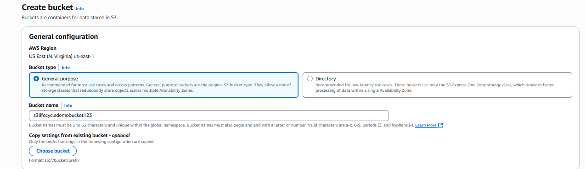
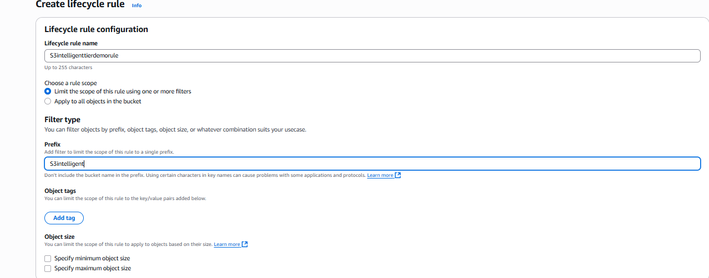

# Configure different lifecycle policies for specific items in an S3 Bucket

## Full Step by Step Guide with snapshots to both describe and illustrate how to set different lifecycle policies for items placed inside an S3 bucket.

### This project will display how to set different lifecycle policies provided by AWS for items contained in an S3 bucket, including: 

*Create a S3 Bucket

*Create a Lifecycle Policy to move objects to the S3 intelligent tier after 60 days

*Create a Lifecycle Policy to move objects to S3 Glacier after 90 days

*Create a Lifecycle Policy to delete objects after 120 days

#### Instructions on how to create an S3 Bucket and individual lifecycle policies

**CREATE A LIFECYCLE POLICY TO MOVE OBJECTS TO S3 INTELLIGENT TIER AFTER 60 DAYS (STEP BY STEP)**

*Select S3 (from AWS search tab)
    
  
    

  
*Select Create Bucket
  
  
    

  
*In the "General Configuration" section, give your Bucket a name
    
  
    

 
*Scroll to the bottom and select Create Bucket
  
  
    

  
*Click on the S3 bucket you just created
    
  
    

  
*Select the Management tab from the top
  
  
    

  
*Select Create Lifecycle Rule from the "Lifecycle Configuration" section
  
  
    

  
*Create a lifecycle rule name and prefix under the "Lifecycle rule configuration" section
  
  
    

  
*Select Transition Current versions of objects.... as well as select the acknowledgement in the "Lifecycle rule actions" section
  
  
    

  
*Select Intelligent Tiering under Choose Storage Class Transitions and 60 for Days after object creation under "Transition current versions of objects between storage classes" section 
  
  
    

  
*Click Create Rule at the bottom
  
  
    

  
*Click on the S3 bucket you just created. Select the Properties tab from the top
  
  
    

  
*Scroll down to where it says S3 Intelligent-Tiering Archive configurations and choose Configuration
  
  
    

  
*Give your configuration a name, select a Prefix and set a tag under the "Archive configuration settings" section 
  
  
    

  
*Click Create on Bottom.

  
    

  

**CREATE A LIFECYCLE POLICY TO MOVE OBJECTS TO S3 GLACIER AFTER 90 DAYS (STEP BY STEP)**

*Select Create Lifecycle Rule from the "Lifecycle Configuration" section
  
  
    

  
*Create a lifecycle rule name and prefix under "Lifecycle rule configuration"
  
  
    

  
*Select "Transition current versions of objects"
  
  
    

  
*Check the acknowledgement box
  
  
    

  
*Under "Lifecycle rule actions," choose "Transition current versions of objects between storage classes"
  
  
    

  
*Select "Glacier Instant Retrieval" as the storage class
  
  
    

  
*Set transition to "90 days after object creation"
  
  
    

  
*Click "Create Rule"
  
  
    

  
 **CREATE A LIFECYCLE POLICY TO DELETE OBJECTS AFTER 120 DAYS**

*Select Create Lifecycle Rule from the "Lifecycle Configuration" section
  
  
    

  
*Create a lifecycle rule name and prefix under "Lifecycle rule configuration"
  
  
    

  
*Select Expire Current versions of objects
  
  
    

  
* Select 120 for Days after object creation
  
  
    

  
* Select the Create Rule button at the bottom
  
  
    

  

##### Contribution Policy

This project is not accepting external contributions, including pull requests or feature requests.

It serves as a personal archive of my learning journey in applying foundational concepts in software development and version control. Active development is not ongoing, and external changes will not be integrated.

Thank you for your understanding.
